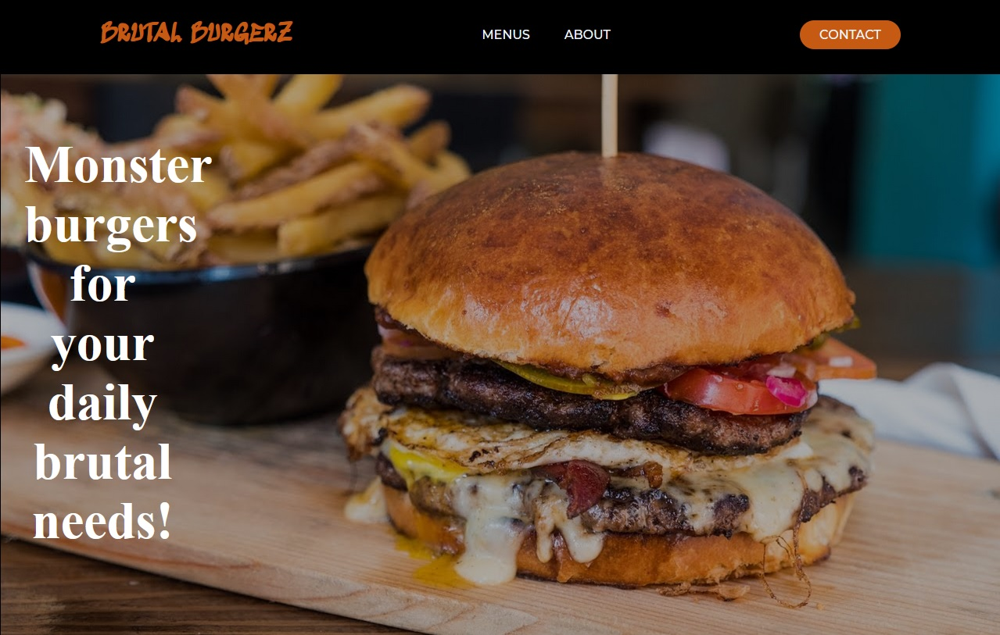

# Restaurant Page

> This is a basic restaurant page built with JavaScript, HTML and CSS. Made as part of the main Technical Curriculum from [Microverse](https://www.microverse.org/). You can check the project guidelines [here](https://www.theodinproject.com/courses/javascript/lessons/restaurant-page). 

## Built With

- HTML,
- CSS (SCSS),
- JavaScript (Node)

## Live Demo

[Live Demo Link](https://matheus-fls.github.io/restaurant-page/)

## Author

**Matheus Silva**

- Github: [@matheus-fls](https://github.com/matheus-fls)
- Twitter: [@Matheus06600798](https://twitter.com/Matheus06600798)
- Linkedin: [Matheus F. Lopes da Silva](https://www.linkedin.com/in/matheus-f-lopes-da-silva-05610a107/)

## 🤝 Contributing

Contributions, issues and feature requests are welcome!

Feel free to check the [issues page](https://github.com/matheus-fls/restaurant-page/issues).

## Show your support

Give a ⭐️ if you like this project!

## Acknowledgments

- Lots of thanks to my Team and my carrer coach Maria Ada Santos for the invaluable feedback.

## 📝 License

This project is [MIT](lic.url) licensed.
